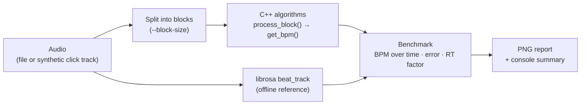

<div align="center">

# tempo-benchmark

**A testbench for real-time BPM detection algorithms written in C++.<br>
Algorithms are fed audio block by block, just as they would be inside an embedded audio callback.**

[](https://github.com/Suuunboy/tempo-benchmark/actions/workflows/ci.yml)


[](LICENSE)

**English** · [Русский](README.ru.md)

</div>

<p align="center">
  
</p>

## Why

A tempo-aware audio device, such as a synced delay, an LFO or a looper, needs a BPM detector. On a microcontroller like the [Electro-Smith Daisy Seed](https://electro-smith.com/products/daisy-seed) (ARM Cortex-M7), that detector has to:

- work **online**, on a stream of small audio blocks, with no look-ahead;
- **converge quickly** after the music starts;
- be **cheap** enough to run alongside the rest of the DSP.

tempo-benchmark lets you develop and compare such algorithms on a desktop. They are written in plain C++17 and depend only on the standard library, so the same source files can be dropped into firmware unchanged. Python streams audio into them block by block, measures accuracy and speed, and compares the results with an offline [librosa](https://librosa.org) reference.

## Features

- **Real-time simulation.** Audio goes to each algorithm in fixed-size blocks (48–1024 samples, like an audio callback), and the BPM estimate is recorded after every block.
- **Any input.** Use a synthetic click track with configurable tempo, length and noise, or any audio file librosa can read (WAV, MP3, FLAC, OGG, …).
- **Reference.** librosa's offline beat tracker is the yardstick for real recordings, where the true tempo is unknown.
- **One-page report.** A single PNG shows the waveform, BPM over time for each algorithm, final estimates, the real-time factor and a summary table.
- **Easy to extend.** A shared `TempoAlgorithm` C++ interface and an algorithm registry mean a new algorithm needs only a few lines of glue code.

## How it works



- **Error** is the final estimate minus the librosa reference BPM. For a synthetic click track, the console also prints the true tempo.
- **Real-time factor** is the audio duration divided by the processing time. Anything above 1x runs faster than real time.

## Algorithms

| Key | Implementation | Approach | Notes |
|---|---|---|---|
| `energy_cpp` | `EnergyBPM` (C++) | Finds energy peaks in ~23 ms windows above an adaptive threshold (mean + k·σ over the last ~1 s). The BPM is the median of recent inter-beat intervals. | O(1) per sample, under 400 bytes of state, no FFT. Works best on percussive music. |
| `autocorr_cpp` | `AutocorrBPM` (C++) | Autocorrelates an onset envelope (10 ms RMS, then a half-wave rectified difference) over the last 6 s, every 0.5 s. The BPM is the median of the last 8 estimates. | More robust on non-percussive material. May lock onto half the tempo above ~140 BPM. |
| `librosa_reference` | `LibrosaReference` (Python) | Runs `librosa.beat.beat_track` on the whole recording. | Offline: the estimate appears only after the recording ends. |

By default, both C++ detectors search the 60–200 BPM range. Constructor parameters change it.

## Quick start

Requirements: Python 3.9+ and a C++17 compiler (GCC, Clang or MSVC).

```bash
git clone https://github.com/Suuunboy/tempo-benchmark.git
cd tempo-benchmark
python -m venv .venv
source .venv/bin/activate        # Windows: .venv\Scripts\activate
pip install -e .
python main.py
```

`pip install -e .` compiles the `tempo_cpp` extension with pybind11 and installs all Python dependencies.

## Usage

```bash
# Default synthetic click track (120 BPM, 12 s)
python main.py

# Custom tempo, duration and noise
python main.py --bpm 140 --duration 20 --noise 0.05

# Your own audio file
python main.py --file path/to/song.mp3

# Only specific algorithms
python main.py --algorithms energy_cpp,librosa_reference

# Daisy Seed-like block size
python main.py --block-size 48

# Save the report without opening a window
python main.py --no-show --output results/run_001.png

# List registered algorithms
python main.py --list
```

| Option | Default | Description |
|---|---|---|
| `--file PATH` | – | Audio file to analyze. Without it, a synthetic click track is used. |
| `--bpm` | `120` | Tempo of the synthetic click track |
| `--duration` | `12` | Length of the synthetic click track, s |
| `--noise` | `0` | White noise level added to the click track (0..1) |
| `--sample-rate` | `22050` | Target sample rate, Hz |
| `--block-size` | `1024` | Samples per processing block (the audio callback size) |
| `--algorithms` | all | Comma-separated list of algorithm keys |
| `--output` | `results/comparison.png` | Where to save the PNG report |
| `--no-show` | off | Save the report without opening a matplotlib window |
| `--list` | – | List registered algorithms and exit |

Console output for the report shown above (`python main.py --bpm 128 --duration 16 --noise 0.05`):

```text
======================================================================
SUMMARY
======================================================================
True BPM (synthetic): 128.00
Reference BPM (librosa): 129.20

Algorithm                         BPM      Error    RT factor
--------------------------------------------------------------
Librosa (reference)            129.20      +0.00        5.8x
EnergyBPM (C++)                130.47      +1.27     6037.2x
AutocorrBPM (C++)              127.95      -1.25     5074.7x
```

## Adding your own algorithm

### C++ (for anything that will run on a device)

1. Add a header to `algorithms/cpp/include/` and a source file to `algorithms/cpp/src/`, with a class derived from `tempo::TempoAlgorithm`:

   ```cpp
   #pragma once
   #include "tempo_algorithm.h"

   namespace tempo {

   class MyBPM : public TempoAlgorithm {
   public:
       void reset(float sample_rate) override;
       void process_block(const float* samples, std::size_t num_samples) override;
       float get_bpm() const override { return current_bpm_; }
       const char* name() const override { return "MyBPM (C++)"; }

   private:
       float current_bpm_{0.0f};
   };

   } // namespace tempo
   ```

2. Expose it in `algorithms/cpp/bindings/python_bindings.cpp`:

   ```cpp
   py::class_<MyBPM, TempoAlgorithm>(m, "MyBPM")
       .def(py::init<>())
       .def("process_block", &process_numpy<MyBPM>, py::arg("samples"));
   ```

3. Add the `.cpp` file to `sources` in `setup.py`.
4. Register it in `register_default_algorithms()` in `src/registry.py`:

   ```python
   register("my_cpp", lambda: tempo_cpp.MyBPM())
   ```

5. Rebuild with `pip install -e .`, then run `python main.py --algorithms my_cpp,librosa_reference`.

### Python (for quick experiments)

Any object with this interface works:

```python
class MyPythonBPM:
    name = "MyPythonBPM"

    def reset(self, sample_rate: float) -> None: ...
    def process_block(self, samples: np.ndarray) -> None: ...  # mono float32 block
    def get_bpm(self) -> float: ...                            # 0.0 until there is an estimate
```

An optional `finalize() -> float` method is called once after the last block. This is how the offline librosa reference works. Register the class in `src/registry.py` with `register("my_py", MyPythonBPM)`.

## Using the algorithms on Daisy Seed

The files in `algorithms/cpp/include/` and `algorithms/cpp/src/` depend only on the C++17 standard library. Copy them into a firmware project and feed the detector from the audio callback. A minimal sketch with [libDaisy](https://github.com/electro-smith/libDaisy):

```cpp
#include "daisy_seed.h"
#include "energy_bpm.h"

using namespace daisy;

DaisySeed       hw;
tempo::EnergyBPM detector;

void AudioCallback(AudioHandle::InputBuffer in, AudioHandle::OutputBuffer out, size_t size)
{
    detector.process_block(in[0], size); // analyze the left input
    for (size_t i = 0; i < size; i++)
        out[0][i] = in[0][i];            // pass audio through
}

int main()
{
    hw.Init();
    hw.SetAudioBlockSize(48);
    detector.reset(hw.AudioSampleRate());
    hw.StartAudio(AudioCallback);

    while (true)
    {
        float bpm = detector.get_bpm(); // 0 until the first estimate
        // ... sync an LFO, a delay time, a sequencer ...
    }
}
```

`EnergyBPM` keeps all of its state in fixed-size arrays. `AutocorrBPM` allocates its envelope buffer in `reset()` and temporary buffers on every tempo update, so it needs a heap.

## Project structure

```text
tempo-benchmark/
├── algorithms/
│   ├── cpp/
│   │   ├── include/              # TempoAlgorithm interface and algorithm headers
│   │   ├── src/                  # algorithm implementations (portable C++17)
│   │   └── bindings/             # pybind11 module tempo_cpp
│   └── python/
│       └── reference_librosa.py  # offline librosa reference
├── src/
│   ├── audio_io.py               # audio loading and click-track generator
│   ├── simulator.py              # block-by-block real-time simulation
│   ├── benchmark.py              # runs the algorithms and computes errors
│   ├── registry.py               # algorithm registry
│   └── visualization.py          # PNG report
├── tests/                        # pytest suite
├── main.py                       # command-line interface
├── setup.py                      # C++ extension build
└── pyproject.toml                # package metadata and dependencies
```

## Running tests

```bash
pip install -e ".[dev]"
pytest
```

The tests check that both C++ detectors find the tempo of synthetic click tracks at 90, 120 and 140 BPM to within ±3 BPM. They also run the whole pipeline end to end, from audio to the saved report.

## References

- E. D. Scheirer, "Tempo and beat analysis of acoustic musical signals", *J. Acoust. Soc. Am.* 103(1), 1998.
- F. Patin, "Beat Detection Algorithms".
- [librosa](https://librosa.org): audio analysis in Python, used for the reference estimate.
- [pybind11](https://github.com/pybind/pybind11): C++ ↔ Python bindings.

## License

[MIT](LICENSE) © 2026 Ivan Afanasov
