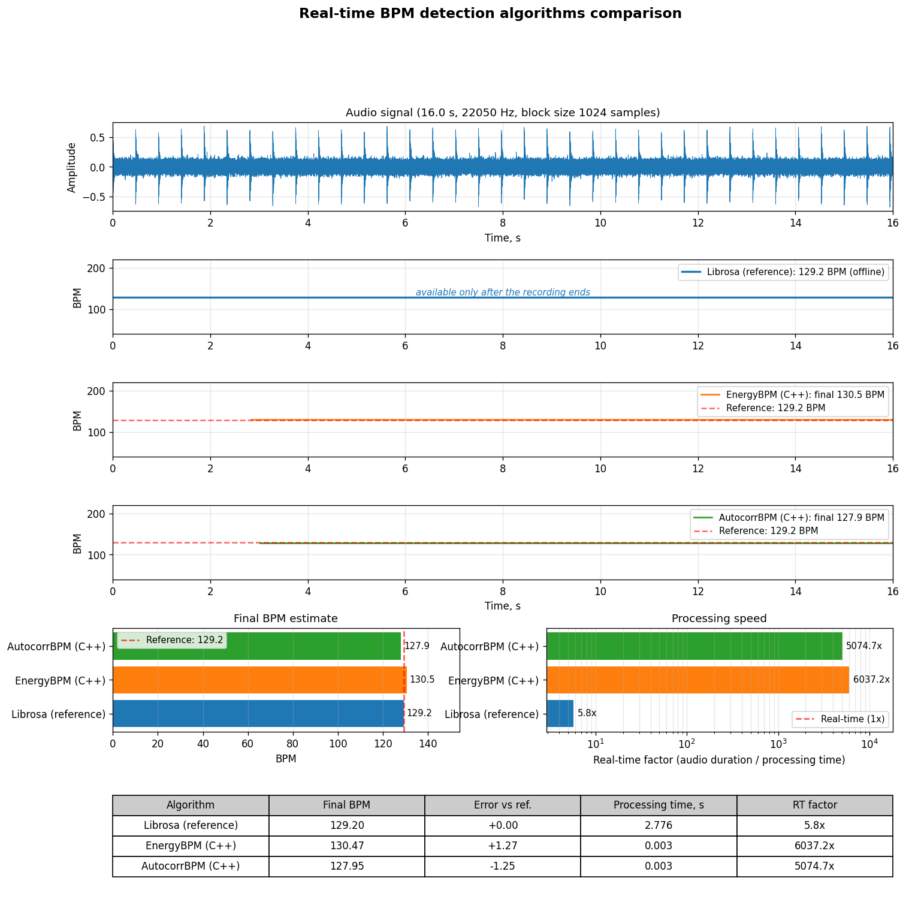
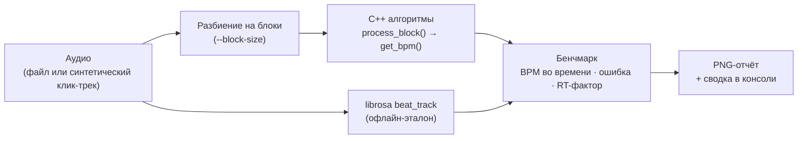

<div align="center">

# tempo-benchmark

**Тестовый стенд для алгоритмов определения темпа (BPM) в реальном времени, написанных на C++.<br>
Аудио подаётся алгоритмам блоками, как в аудио-callback'е встраиваемого устройства.**

[](https://github.com/Suuunboy/tempo-benchmark/actions/workflows/ci.yml)


[](LICENSE)

[English](README.md) · **Русский**

</div>

<p align="center">
  
</p>

## Зачем

Устройству, которое подстраивается под темп (синхронный дилей, LFO, лупер), нужен детектор BPM. На микроконтроллере вроде [Electro-Smith Daisy Seed](https://electro-smith.com/products/daisy-seed) (ARM Cortex-M7) такой детектор должен:

- работать **онлайн**, на потоке небольших аудио-блоков, не заглядывая в будущее;
- **быстро сходиться** после начала музыки;
- быть достаточно **дешёвым**, чтобы работать рядом с остальным DSP.

tempo-benchmark позволяет разрабатывать и сравнивать такие алгоритмы на компьютере. Они написаны на чистом C++17 и зависят только от стандартной библиотеки, поэтому те же исходники переносятся в прошивку без изменений. Python подаёт им аудио блок за блоком, измеряет точность и скорость и сравнивает результат с офлайн-эталоном на [librosa](https://librosa.org).

## Возможности

- **Имитация реального времени.** Аудио подаётся каждому алгоритму блоками фиксированного размера (48–1024 сэмпла, как в аудио-callback'е), оценка BPM записывается после каждого блока.
- **Любой вход.** Синтетический клик-трек с настраиваемыми темпом, длительностью и шумом или любой аудиофайл, который читает librosa (WAV, MP3, FLAC, OGG, …).
- **Эталон.** Для реальных записей, где истинный темп неизвестен, эталоном служит офлайн-трекер битов librosa.
- **Отчёт на одной странице.** Один PNG с осциллограммой, BPM во времени для каждого алгоритма, финальными оценками, RT-фактором и сводной таблицей.
- **Легко расширять.** Благодаря общему C++-интерфейсу `TempoAlgorithm` и реестру алгоритмов новый алгоритм подключается несколькими строками.

## Как это работает



- **Ошибка** равна финальной оценке минус эталонный BPM от librosa. Для синтетического клик-трека в консоль также выводится истинный темп.
- **RT-фактор** равен длительности аудио, делённой на время обработки. Всё, что выше 1x, работает быстрее реального времени.

## Алгоритмы

| Ключ | Реализация | Подход | Особенности |
|---|---|---|---|
| `energy_cpp` | `EnergyBPM` (C++) | Ищет пики энергии в окнах ~23 мс выше адаптивного порога (среднее + k·σ за последнюю ~1 с). BPM равен медиане последних межбитовых интервалов. | O(1) на сэмпл, меньше 400 байт состояния, без FFT. Лучше всего работает на перкуссионной музыке. |
| `autocorr_cpp` | `AutocorrBPM` (C++) | Каждые 0,5 с считает автокорреляцию огибающей атак (RMS по 10 мс, затем однополупериодно выпрямленная разность) за последние 6 с. BPM равен медиане последних 8 оценок. | Устойчивее на неперкуссионном материале. Выше ~140 BPM может выдать половинный темп. |
| `librosa_reference` | `LibrosaReference` (Python) | Запускает `librosa.beat.beat_track` на всей записи. | Офлайн: оценка появляется только после окончания записи. |

По умолчанию оба C++-детектора ищут темп в диапазоне 60–200 BPM. Диапазон задаётся параметрами конструктора.

## Быстрый старт

Нужны Python 3.9+ и компилятор C++17 (GCC, Clang или MSVC).

```bash
git clone https://github.com/Suuunboy/tempo-benchmark.git
cd tempo-benchmark
python -m venv .venv
source .venv/bin/activate        # Windows: .venv\Scripts\activate
pip install -e .
python main.py
```

`pip install -e .` собирает расширение `tempo_cpp` через pybind11 и ставит все Python-зависимости.

## Использование

```bash
# Синтетический клик-трек по умолчанию (120 BPM, 12 с)
python main.py

# Свои темп, длительность и шум
python main.py --bpm 140 --duration 20 --noise 0.05

# Свой аудиофайл
python main.py --file path/to/song.mp3

# Только выбранные алгоритмы
python main.py --algorithms energy_cpp,librosa_reference

# Размер блока как на Daisy Seed
python main.py --block-size 48

# Сохранить отчёт, не открывая окно
python main.py --no-show --output results/run_001.png

# Список зарегистрированных алгоритмов
python main.py --list
```

| Параметр | По умолчанию | Описание |
|---|---|---|
| `--file PATH` | – | Аудиофайл для анализа. Без него используется синтетический клик-трек. |
| `--bpm` | `120` | Темп синтетического клик-трека |
| `--duration` | `12` | Длительность синтетического клик-трека, с |
| `--noise` | `0` | Уровень белого шума в клик-треке (0..1) |
| `--sample-rate` | `22050` | Целевая частота дискретизации, Гц |
| `--block-size` | `1024` | Сэмплов в блоке обработки (размер аудио-callback'а) |
| `--algorithms` | все | Ключи алгоритмов через запятую |
| `--output` | `results/comparison.png` | Куда сохранить PNG-отчёт |
| `--no-show` | выкл. | Сохранить отчёт без открытия окна matplotlib |
| `--list` | – | Показать зарегистрированные алгоритмы и выйти |

Вывод в консоль для отчёта с картинки выше (`python main.py --bpm 128 --duration 16 --noise 0.05`):

```text
======================================================================
SUMMARY
======================================================================
True BPM (synthetic): 128.00
Reference BPM (librosa): 129.20

Algorithm                         BPM      Error    RT factor
--------------------------------------------------------------
Librosa (reference)            129.20      +0.00        5.8x
EnergyBPM (C++)                130.47      +1.27     6037.2x
AutocorrBPM (C++)              127.95      -1.25     5074.7x
```

## Добавление своего алгоритма

### На C++ (для всего, что будет работать на устройстве)

1. Добавьте заголовок в `algorithms/cpp/include/` и исходник в `algorithms/cpp/src/` с классом-наследником `tempo::TempoAlgorithm`:

   ```cpp
   #pragma once
   #include "tempo_algorithm.h"

   namespace tempo {

   class MyBPM : public TempoAlgorithm {
   public:
       void reset(float sample_rate) override;
       void process_block(const float* samples, std::size_t num_samples) override;
       float get_bpm() const override { return current_bpm_; }
       const char* name() const override { return "MyBPM (C++)"; }

   private:
       float current_bpm_{0.0f};
   };

   } // namespace tempo
   ```

2. Добавьте биндинг в `algorithms/cpp/bindings/python_bindings.cpp`:

   ```cpp
   py::class_<MyBPM, TempoAlgorithm>(m, "MyBPM")
       .def(py::init<>())
       .def("process_block", &process_numpy<MyBPM>, py::arg("samples"));
   ```

3. Добавьте `.cpp`-файл в `sources` в `setup.py`.
4. Зарегистрируйте алгоритм в `register_default_algorithms()` в `src/registry.py`:

   ```python
   register("my_cpp", lambda: tempo_cpp.MyBPM())
   ```

5. Пересоберите командой `pip install -e .` и запустите `python main.py --algorithms my_cpp,librosa_reference`.

### На Python (для быстрых экспериментов)

Подойдёт любой объект с таким интерфейсом:

```python
class MyPythonBPM:
    name = "MyPythonBPM"

    def reset(self, sample_rate: float) -> None: ...
    def process_block(self, samples: np.ndarray) -> None: ...  # моно-блок float32
    def get_bpm(self) -> float: ...                            # 0.0, пока нет оценки
```

Необязательный метод `finalize() -> float` вызывается один раз после последнего блока. Так устроен офлайн-эталон на librosa. Зарегистрируйте класс в `src/registry.py`: `register("my_py", MyPythonBPM)`.

## Использование алгоритмов на Daisy Seed

Файлы из `algorithms/cpp/include/` и `algorithms/cpp/src/` зависят только от стандартной библиотеки C++17. Скопируйте их в проект прошивки и подавайте детектору аудио из callback'а. Минимальный набросок на [libDaisy](https://github.com/electro-smith/libDaisy):

```cpp
#include "daisy_seed.h"
#include "energy_bpm.h"

using namespace daisy;

DaisySeed       hw;
tempo::EnergyBPM detector;

void AudioCallback(AudioHandle::InputBuffer in, AudioHandle::OutputBuffer out, size_t size)
{
    detector.process_block(in[0], size); // анализируем левый вход
    for (size_t i = 0; i < size; i++)
        out[0][i] = in[0][i];            // пропускаем звук насквозь
}

int main()
{
    hw.Init();
    hw.SetAudioBlockSize(48);
    detector.reset(hw.AudioSampleRate());
    hw.StartAudio(AudioCallback);

    while (true)
    {
        float bpm = detector.get_bpm(); // 0, пока нет первой оценки
        // ... синхронизация LFO, времени дилея, секвенсора ...
    }
}
```

`EnergyBPM` хранит всё состояние в массивах фиксированного размера. `AutocorrBPM` выделяет буфер огибающей в `reset()` и временные буферы при каждом пересчёте темпа, поэтому ему нужна куча.

## Структура проекта

```text
tempo-benchmark/
├── algorithms/
│   ├── cpp/
│   │   ├── include/              # интерфейс TempoAlgorithm и заголовки алгоритмов
│   │   ├── src/                  # реализации алгоритмов (переносимый C++17)
│   │   └── bindings/             # pybind11-модуль tempo_cpp
│   └── python/
│       └── reference_librosa.py  # офлайн-эталон на librosa
├── src/
│   ├── audio_io.py               # загрузка аудио и генератор клик-трека
│   ├── simulator.py              # поблочная имитация реального времени
│   ├── benchmark.py              # запуск алгоритмов и расчёт ошибок
│   ├── registry.py               # реестр алгоритмов
│   └── visualization.py          # PNG-отчёт
├── tests/                        # тесты pytest
├── main.py                       # интерфейс командной строки
├── setup.py                      # сборка C++-расширения
└── pyproject.toml                # метаданные пакета и зависимости
```

## Тесты

```bash
pip install -e ".[dev]"
pytest
```

Тесты проверяют, что оба C++-детектора находят темп синтетических клик-треков на 90, 120 и 140 BPM с точностью ±3 BPM. Кроме того, они прогоняют весь конвейер целиком, от аудио до сохранённого отчёта.

## Литература

- E. D. Scheirer, "Tempo and beat analysis of acoustic musical signals", *J. Acoust. Soc. Am.* 103(1), 1998.
- F. Patin, "Beat Detection Algorithms".
- [librosa](https://librosa.org): анализ аудио на Python, используется для эталонной оценки.
- [pybind11](https://github.com/pybind/pybind11): биндинги C++ ↔ Python.

## Лицензия

[MIT](LICENSE) © 2026 Ivan Afanasov
